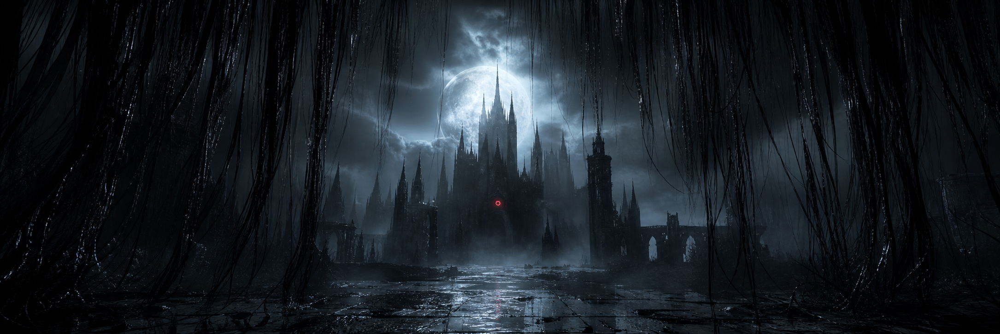

<div align="center">
  
</div>

<p align="center">
  
</p>

<h1 align="center">𓆩&nbsp;<code>menace</code>&nbsp;𓆪</h1>

<p align="center">
  <strong>React Fullstack Developer</strong><br/>
  <em>cold interfaces, strict types · холодные интерфейсы, строгие типы</em>
</p>

<p align="center">
  
</p>

<p align="center">
  <a href="https://github.com/sasuke22233"></a>
  <a href="https://t.me/Menaceeq"></a>
</p>

<p align="center">
  
</p>

---

<table>
<tr>
<td width="50%" valign="top">

### EN · behind the veil

I build **React** products end-to-end: the interface, the API, the schema behind it.  
TypeScript is the load-bearing stone. Quiet UI. Strict types. Databases that tell the truth.

Currently drawing blueprints in **Next.js**, **Node/Nest**, **PostgreSQL**.

> *One red light in the fog. The rest is structure.*

</td>
<td width="50%" valign="top">

### RU · за вуалью

Собираю **React**-продукты целиком: интерфейс, API, схема за ними.  
TypeScript — несущий камень. Тихий UI. Строгие типы. Базы, которые не врут.

Сейчас делаю чертежи на **Next.js**, **Node/Nest**, **PostgreSQL**.

> *Один красный свет в тумане. Остальное — структура.*

</td>
</tr>
</table>

<p align="center">
  
</p>

## ⌠  stack  /  стек

<p align="center">
  
</p>

```text
  frontend   React · Next.js (App Router) · TypeScript · Tailwind · Zustand/Redux
  backend    Node.js · NestJS · tRPC / REST · Prisma · PostgreSQL · Redis
  craft      Git · Docker · CI · testing (Vitest / Playwright) · Figma → code
```

<details>
<summary><strong>the full reliquary · полный реликварий</strong></summary>
<br/>

**UI** — React, Next.js, Vite, React Query, Zustand, Redux Toolkit, Tailwind, CSS Modules, Framer Motion, Radix, Storybook  
**Server** — Node.js, NestJS, Express, tRPC, GraphQL, REST, WebSockets  
**Data** — PostgreSQL, Prisma, MongoDB, Redis  
**Ops** — Docker, GitHub Actions, Vercel, Linux  
**Craft** — accessibility, design systems, performance, DX

</details>

<p align="center">
  
</p>

## ⌠  chronicles  /  хроники

<p align="center">
  
  
</p>

<p align="center">
  
</p>

<p align="center">
  
</p>

## ⌠  selected works  /  избранное


| shrine / проект | rite / суть |
| :--- | :--- |
| **cathedral-ui** | Design system on React + Tailwind. Ice-dark tokens, a11y. |
| **reliquary-api** | NestJS + Prisma + PostgreSQL. Auth, RBAC, typed contracts. |
| **nave** | Next.js fullstack: SSR, server actions, quiet motion. |
| **stained-glass** | Component library — one red light in a cold layout. |

<p align="center">
  
</p>

## ⌠  correspondence  /  переписка

<p align="center">
  Open to work, collaboration, and strange ideas.<br/>
  Открыт к работе, коллаборациям и странным идеям.
</p>

<p align="center">
  <a href="https://t.me/Menaceeq"><code>t.me/Menaceeq</code></a>
</p>

<br/>

<p align="center">
  
</p>

<p align="center">
  <sub>© menace · one red light in the fog</sub>
</p>
